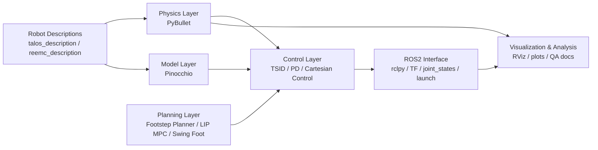

# Simulation-based Modeling and Control of Humanoid Robot

> A research-oriented ROS2 workspace for humanoid modeling, whole-body control, balance recovery, and walking synthesis on **Talos**.

## Abstract

This repository organizes a complete humanoid robotics learning and experimentation pipeline around the Talos platform. The workspace connects **rigid-body geometry**, **floating-base dynamics**, **ROS2 visualization**, **whole-body task-space control**, **balance analysis**, and **walking generation** into a reproducible sequence of tutorials and executable scripts.  
From the perspective of system design, the project couples **PyBullet** for physics simulation, **Pinocchio** for model-based kinematics and dynamics, **TSID** for whole-body control, and **Drake/Pydrake** for optimal control and MPC exercises. The result is not merely a set of isolated demos, but a compact research sandbox for studying the transition from mathematical formulation to embodied humanoid behavior.

## Research Scope

The repository covers four progressively coupled problem classes:

1. **Geometric representation and spatial transformation**  
   SE(3), twist, wrench, TF broadcasting, and RViz-based interpretation.

2. **Floating-base dynamics and low-level control**  
   PyBullet-Pinocchio state bridging, inverse dynamics, and joint-space tracking.

3. **Whole-body balance and disturbance rejection**  
   TSID standing control, one-leg support, squatting, ZMP/CMP/DCM analysis, and ankle/hip recovery strategies.

4. **Locomotion generation**  
   Footstep planning, swing-foot trajectory synthesis, LIP-based MPC, and integrated walking simulation.

## Method Stack

| Layer | Core tools | Role in the pipeline |
|---|---|---|
| Middleware | ROS2, `rclpy`, TF, RViz | Data transport, launch, visualization |
| Physics | PyBullet | Forward simulation, contact, disturbance injection |
| Modeling | Pinocchio | Kinematics, dynamics, spatial algebra |
| Whole-body control | TSID | Task-space inverse dynamics for posture and balance |
| Planning / OCP / MPC | Drake, Pydrake | OCP exercises and LIP-based predictive control |

## System Architecture



## Repository Anatomy

```text
ros_legged_robot/
├── bullet_sims/         # T2-T3: floating-base dynamics and control executables
├── ros_visuals/         # T1, T4-T7: visualization, TSID, balance, MPC, walking
├── simulator/           # Shared simulation abstractions and PyBullet bridge
├── talos_description/   # Talos URDF and meshes
├── reemc_description/   # Additional robot description assets
├── QA/                  # Submission-style experiment writeups
└── docs/                # Project conclusions and supporting notes
```

### Package Roles

| Package | Function | Main entrypoints |
|---|---|---|
| `bullet_sims` | Dynamics exercises and control switching experiments | `t2_temp`, `t21`, `t22`, `t23`, `t3_main` |
| `ros_visuals` | TF demos, TSID tasks, balance experiments, locomotion scripts | `t11`, `t12`, `t13`, `t4_standing`, `one_leg_stand`, `squating`, `t51`, `t52`, `teleop_marker`, `interactive` |
| `simulator` | Reusable simulation wrapper and robot abstraction | library only |

## Tutorial Roadmap

| Tutorial | Theme | Representative scripts |
|---|---|---|
| `T1` | SE(3), twist, wrench, and TF visualization | `t11.py`, `t12.py`, `t13.py` |
| `T2` | Floating-base dynamics and joint-space control | `t2_temp.py`, `t21.py`, `t22.py`, `t23.py` |
| `T3` | Joint-space to Cartesian-space control transition | `t3_main.py` |
| `T4` | TSID standing, one-leg support, and squatting | `t4_standing.py`, `one_leg_stand.py`, `squating.py` |
| `T5` | ZMP/CMP/DCM and push-recovery strategy comparison | `t51.py`, `t52.py` |
| `T6` | OCP and MPC foundations with Drake/Pydrake | `example_2_pydrake.py`, `ocp_lipm_2ord.py`, `mpc_lipm_2ord.py` |
| `T7` | Footstep planning, swing trajectory, and walking integration | `footstep_planner.py`, `foot_trajectory.py`, `lip_mpc.py`, `walking.py` |

## Experimental Narrative

The project is best understood as a layered progression rather than a flat list of scripts:

- **T1-T3** establish the mathematical and simulation substrate: coordinate transformations, rigid-body dynamics, and controller design.
- **T4-T5** elevate the problem into whole-body regulation, where posture, center of mass motion, and disturbance rejection become central.
- **T6-T7** move from regulation to generation, introducing predictive models, footstep scheduling, and closed-loop walking synthesis.

This ordering mirrors a common research workflow in humanoid locomotion:  
**modeling -> control -> balance analysis -> predictive planning -> integrated gait generation**.

## Environment

- Ubuntu with ROS2
- Python `3.10+`
- `colcon`
- Python dependencies:
  - `pybullet`
  - `pinocchio`
  - `tsid`
  - `numpy`
  - `scipy`
  - `matplotlib`
- Optional for `T6-T7`:
  - `pydrake`

> Dependencies are not pinned in this repository. For reproducible experiments, use a dedicated virtual environment and export the package versions explicitly.

## Quick Start

### 1. Build the workspace

```bash
cd ros_legged_robot
colcon build --symlink-install
source install/setup.bash
```

### 2. Run the tutorials

```bash
# T1: TF / SE(3) / spatial quantities
ros2 launch ros_visuals launch_t11.py
ros2 launch ros_visuals launch_t12.py
ros2 launch ros_visuals launch_t13.py

# T2: floating-base dynamics and joint control
ros2 run bullet_sims t2_temp
ros2 run bullet_sims t21
ros2 run bullet_sims t22
ros2 run bullet_sims t23
ros2 launch ros_visuals talos_rviz.launch.py

# T3: joint-space -> Cartesian-space transition
ros2 run bullet_sims t3_main

# T4: TSID standing / one-leg support / squat
ros2 run ros_visuals t4_standing
ros2 run ros_visuals one_leg_stand
ros2 run ros_visuals squating

# T5: push recovery and balance strategies
ros2 run ros_visuals t51
ros2 run ros_visuals t52

# T6: OCP / MPC exercises
source ~/drake_env/bin/activate
python3 ros_visuals/ros_visuals/example_2_pydrake.py
python3 ros_visuals/ros_visuals/ocp_lipm_2ord.py
python3 ros_visuals/ros_visuals/mpc_lipm_2ord.py

# T7: walking pipeline
python3 ros_visuals/ros_visuals/foot_trajectory.py
python3 ros_visuals/ros_visuals/footstep_planner.py
python3 ros_visuals/ros_visuals/walking.py
```

### 3. Optional interaction tools

```bash
ros2 run ros_visuals teleop_marker
ros2 run ros_visuals interactive
rviz2
```

## Balance Strategy Configuration

In `t51.py` and `t52.py`, the balance-recovery comparison is controlled through:

- `use_ankle_strategy`
- `use_hip_strategy`

Recommended ablation settings:

- no strategy
- ankle only
- hip only
- ankle + hip

## Outputs and Artifacts

Generated plots are typically written to:

- `ros_legged_robot/ros_visuals/ros_visuals/images/`

Representative outputs include:

- `T4_com_comparison_plot.png`
- `t51_plot_*.png`
- `t52_plot_*.png`

Additional written materials:

- `QA/submission_01_tutorials_1_2.md`
- `QA/submission_02_tutorial_5.md`
- `docs/project_conclusion_CN.md`

## Reproducibility Notes

- Use `--symlink-install` for faster iteration on Python packages.
- Re-source the workspace after rebuilding:

```bash
source ros_legged_robot/install/setup.bash
```

- Some launch files assume a standard ROS workspace layout.
- Disturbance-recovery experiments should be run as separate configurations and compared through saved plots.

## Closing Remark

Rather than presenting humanoid locomotion as a monolithic black box, this repository exposes the pipeline in interpretable layers: from spatial algebra and robot dynamics to whole-body balance and predictive walking. In that sense, it functions both as an instructional workspace and as a compact experimental platform for model-based humanoid control research.
